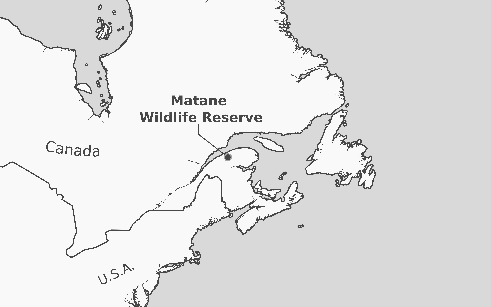
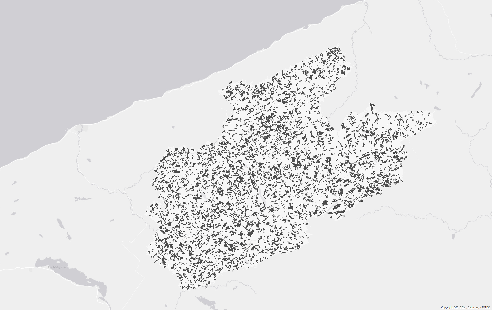

```{r setup, include = FALSE}
library(knitr)
library(kableExtra)

if (params$refresh) {
  # Source for the figures
  knitr::knit("contrasts.Rmd")
}
```

```{r, include=FALSE}
options(tinytex.verbose = TRUE)
```

<details>

<summary>Author information</summary>

Etienne B. Racine\*<br>
ORCID : 0000-0003-1109-894X<br>
Département des sciences du bois et de la forêt<br>
2405 rue de la Terrasse, Université Laval, Québec, QC G1V 0A6, Canada<br>
etienne.bellemare-racine.1@ulaval.ca

Nicholas C. Coops<br>
ORCID : 0000-0002-0151-9037<br>
Department of Forest Resources Management<br>
2424 Main Mall, University of British Columbia, Vancouver, BC V6T 1Z4, Canada<br>
nicholas.coops@ubc.ca
--
Jean Bégin<br>
ORCID : 0000-0002-9595-6632<br>
Département des sciences du bois et de la forêt<br>
2405 rue de la Terrasse, Université Laval, Québec, QC G1V 0A6, Canada<br>
jean.begin@sbf.ulaval.ca

Mari Myllymäki<br>
ORCID : 0000-0002-2713-7088<br>
Natural Resources Institute Finland (Luke)<br>
Latokartanonkaari 9, FI-00790 Helsinki, Finland<br>
mari.myllymaki@luke.fi

(\*) Corresponding Author
</details>

Keywords: Boreal forest; Lidar remote sensing; Tree Species; Functional
data analysis; Stand structure.

Acknowledgments
================

We thank Benoit St-Onge, Nicole K. S. Barker, Sebastien Renard,
Christian Roy and Josh Nowak for comments on early versions of this
manuscript, Anick Patry, Antoine Leboeuf and Marc-Olivier Lemonde from
Ministère de la Forêt, de la Faune et des Parcs for providing data and
support.

Declarations
================

Funding
------------

This work was supported by the Ministère de la Forêt de la Faune et des
Parcs du Québec through the Fonds de Recherche Québécois sur la Nature
et les Technologies. MM was financially supported by the Academy of
Finland (project numbers 295100 and 327211).

Conflicts of interest/Competing interests
----------------------------------------------

We declare no conflict of interest.

Availability of data and material
-------------------------------------

The original data was shared and is available upon request to the
Gouvernement du Québec. The processed data is available in our
repository https://github.com/etiennebr/vertical-lidar-paper

Code availability
----------------------

The code to perform the analysis is available in a git repository at
https://github.com/etiennebr/vertical-lidar-paper

### Author contribution statement

ER is the primary author of the manuscript. ER, NCC and JB contributed
to the design of the study; the analysis was conducted by ER and MM, the
redaction was conducted by ER and revised by other authors; all authors
read and approved this version to be published.

Key Message
===========

Using LiDAR remote sensing to assess even-aged stands vertical
distributions, we find that species, age, and crown closure all drive
distribution variations. Age raises vertical profile distributions until
a plateau and ultimate decline at maturity, and increases in crown
closure concentrate LiDAR returns in more distinct layers. While these
patterns are consistent across species, they are statistically distinct.

Abstract
========

Different tree species have different overall shapes,
canopy structures, and as such, forest stand dynamics. Light detection
and ranging (LiDAR) provides the ability to measure the position of
reflective material by sending laser pulses through the canopy. In this
paper we examine the influence of three forest stand attributes:
species, crown closure, and age on the vertical distribution of aerial
LiDAR returns of forested stands. We studied over five thousand regular,
even-aged stands in Quebec (Canada) with five dominant species: balsam
fir (*Abies balsamea* (L.) Mill.), paper birch (*Betula papyrifera*
Marsh), black spruce (*Picea mariana* (Mill.) BSP), white spruce (*Picea glauca* 
Moench) and aspen (*Populus tremuloides* Michx.). We used a
novel nonparametric graphical test of significance to compare species,
crown closure, and age groups. Results indicate that aspen stands had the
most uniform vertical distribution of LiDAR returns; balsam fir and
white birch distributions were similar and centered around 50% of the
stand height; black spruce and white spruce vertical distributions were
skewed below 30% of stand height (p<0.001). An increase in crown closure
concentrated the vertical distribution of returns around 50% height. Age
gradually shifted the distribution higher in the stand until 50–70
years, plateaued and slowly declined at 90–120 years. Most of the
variations happened below 80% of stand height, and the area between 35–60% 
was to be the most discriminant for species, crown closure,
and age.

Introduction
=========================

The distribution of vegetation material within canopies varies with tree
allometry and competition strategies, leading to variations in canopy
structure and ultimately in environmental conditions
[@pretzsch_dieler12; @purves_etal07; @thorpe_etal10]. Species‑specific canopy 
structures create different
microhabitats, light conditions and microclimates which in turn
influence rates at which stands sequester carbon. Species have different
carbon allocation strategies that evolve during the growth season
relative to above and below ground carbon allocation such as growing
fruit, deploying leaves or root access to nutrients and water
[@depury_farquhar97; @lacointe00; @stark_etal12]. Biomass is a feedback loop: 
more biomass generally allows for
increased production of biomass. These growth and allocation strategies
vary by species resulting in archetypal tree morphologies that will
have predictable, although complex, reactions to growth conditions. This
results in the distinct species-specific tree shapes.

Traditionally, characterization of stand above-ground biomass vertical
distribution required either on-site estimation of biomass per vertical
layer using scaffolding, tree climbing, or destructive measurements that
are time-consuming and limited to small areas. Scaling these
observations to the landscape is very difficult using traditional
techniques [@macarthur_horn69; @aber79; @bassow_bazzaz97; @tackenberg07].

Forest remote sensing
---------------------------

The increasing availability of data collected remotely from airborne,
spaceborne and terrestrial sensors has improved our understanding of the
forest dynamics [@wulder_etal12; @white_etal13; @beland_etal19]. 
Among these sensors, light detection and ranging
(LiDAR) has the ability to penetrate the canopy and provide information
on the spatial location of reflective material. LiDAR is increasingly
used to perform both extensive and highly detailed imaging of the
forest. It uses a laser which location and orientation are precisely
known to record a 3D scene. When penetrating the canopy, a LiDAR pulse
hits vegetative material which is reflected back to the sensor and
recorded. LiDAR can be used from the ground, and from an aircraft to
provide different perspectives on the forest. Terrestrial LiDAR provides
highly detailed structural information of individual trees, but its
extent is limited to hundreds of meters [@beland_etal19;
@crespo-peremarch_etal20]. Airborne LiDAR on the other hand, is generally used
for extensive landscape measurements that are generally less detailed than
terrestrial LiDAR.

Airborne LiDAR has been used to characterize vertical canopy structure, crown
shape, and ecosystem's above-ground biomass [@ellsworth_reich93;
@harding_etal01; @lefsky_etal02; @parker_etal04; @coops_etal07; @stark_etal12;
@cao_etal14; @papa_etal20], to identify tree species [@heinzel_koch11; @heinzel_koch12;
@vaughn_etal12; @hovi_etal16; @fassnacht_etal16; @budei_etal18;
@axelsson_etal18; @fedrigo_etal18], and to study stand characteristics such as
age, crown closure and basal area [@korhonen_etal11; @white_etal13;
@racine_etal14]. Airborne LiDAR is an important tool to quantify biomass and
offers many opportunities to explore large-scale phenomena that could only be
observed on the field, such as large-scale habitat characterization
[@vierling_etal08; @vierling_etal10; @seavy_etal09].

One of the limitations of the conventional small footprint LiDAR sensors is its
inability to distinguish differences in foliage condition or species spectral
variations because it lacks spectral information commonly used to classify
species (such as variations in color or near infrared). In response, the most
common strategy to distinguish species with LiDAR has been to rely on individual
tree shapes and texture [@holmgren_persson04; @kim_etal11; @fassnacht_etal16],
add spectral information by supplementing it with spectral imagery, and more recently
using a multispectral LiDAR [@budei_etal18; @budei_st-onge18].

Most species classification studies using aerial LiDAR have focused on
individual tree-crown species identification. Tree crown delineation requires a
high number of LiDAR returns and very accurate registration of ground
observations [@orka_etal09; @muss_etal11]. Furthermore, using such a small
observation area, the number of LiDAR returns decreases and the vertical
distribution increasingly becomes a collection of random deviates and loses the
general distribution shape. For that reason, accuracy in species identification
is improved by increasing point density up to 10 pt/m² [@fassnacht_etal16].

Aerial LiDAR is also used in area-based approaches (see e.g. @white_etal13 for 
an exhaustive description). This approach generally uses a stand or a pixel on which
LiDAR returns are aggregated and from which predictors are derived and then used
in a model to predict forest attributes. LiDAR metrics often derive predictors
from the vertical distribution of LiDAR returns: the number or LiDAR returns
per height slice. The vertical distribution of LiDAR returns is often presented
as quantiles, projections of quantiles (such as principal component analysis),
or parametric functions (such as a Fourier, beta or Weibull function), which
are used to predict stand attributes [@magnussen_etal99; @maltamo_etal05;
@mehtatalo06; @coops_etal07; @riggins_etal09; @falkowski_etal09; @racine_etal14;
@palace_etal15]. The area-based method can be effective with point density
as low as 1 pt/m², which reduces cost and processing compared to tree-crown
approaches [@white_etal13].

Some studies explicitly mentioned that species vertical distribution of LiDAR
returns were different. For example, @orka_etal09 found that first and last
returns were more dispersed in Birch (*Betula* spp.) than in Norway spruce
(*Picea abies* (L.) Karst.), which also had a vertical distribution of first
returns skewed toward the superior canopy, and that increased stand height
modified the overall return distribution.

Objectives
----------

In this paper, we combined ideas from the tree-crown approach to species
identification, the vertical biomass distribution, and the large scale
area-based method to compare vertical distribution of LiDAR returns of different
species, ages and crown closure, which are known to affect the stand structure.
We speculate that intraspecific variations of LiDAR distribution patterns are
smaller than interspecific variations after accounting for stand crown closure
and age.

Method
====================

Study area
----------

The study was conducted in Matane Wildlife Reserve (Quebec, Canada,
48°41’N, -66°58’E) covering 1600 km² (Figure \@ref(fig:fig-loc)). The Reserve is a mixed
forest mostly dominated by balsam fir (*Abies balsamea* (L.) Mill.),
paper birch (*Betula papyrifera* Marsh) and black spruce (*Picea
mariana* (Mill.) BSP), but other species are present such as white
spruce (*Picea glauca* Moench), aspen (*Populus tremuloides *Michx.),
norway spruce (*Picea abies* (L.) Karst.), jack pine (*Pinus banksiana*
Lamb.) and other noncommercial deciduous species. Most of the Reserve is
under active commercial logging, which was documented since 1962: 27% of
the area had been harvested (mostly total harvesting) of which half of
the areas had been replanted. Other natural origins (e.g. windthrow,
insect epidemic, fire) accounted for 2% of the territory and the
remaining 72% of the territory had an undocumented origin. Having
documented origin of stands helped the photo-interpreters to calibrate
their observations.

```{r include = FALSE}
fig_loc_caption <- 
"Location of Matane Wildlife Reserve (left
panel) and selected stands within the study area (right panel, dark
patches)."
fig_loc_short_caption <- "Location of Matane Wildlife Reserve and selected stands."
```

```{r fig-loc, fig.show = "hold", out.width = "50%", fig.cap=fig_loc_caption, fig.scap=fig_loc_short_caption, echo = FALSE}


```

Data
----

Airborne imagery and LiDAR were acquired during the summer of 2007. All
data were collected by the Quebec Ministry of Natural Resources as part
of their decennial forest mapping program. LiDAR survey had a nominal
point density of 3 points/m² with an Optech ALTM 2050 sensor recording
first and last returns at 40kHz, flown at 1200 m above ground, with a
flight overlap of 30% and maximal scan angle of 15° from nadir with a
nominal footprint diameter of 25 cm.

Airborne photography was acquired with a Leica ADS–40 pushbroom camera
at 0.2 and 0.5 m resolution for panchromatic and near-infrared, green
and blue bands (NIR, G, B respectively centered on 860, 560 and 460 nm);
side overlap was 40% to ensure complete coverage of the area. This
imagery was interpreted into stands following provincial guidelines
(MRNQ 2007) by expert photo-interpreters. Using digital
stereopsis (virtual 3D vision from stereo images) from the forward and
nadir-facing ADS–40 sensor, the expert photo-interpreter discriminate
many species by integrating information on landscape position, crown
shapes, texture and color. Every photo was segmented into homogenous
stands using species, crown closure, height and geomorphic criteria.
Each stand was classified regarding species composition, crown closure,
age, height and other ecological parameters using a combination of
photography, ground-control points and historical data as reference.
Stand age is estimated using ground control plots where trees were
cored, this information is then combined with available archives, height
and ecology to judge age from aerial photography. Forest age is
interpreted in 7 broad age classes: (10 [0–20], 30 [21–40], 50
[41–60], 70 [61–80], 90 [81–100], 120 [101, ∞[, and irregular).
Crown closure is visually estimated by comparing the proportion of open
ground with the space occupied by the mature tree crowns. It is
estimated in 9 classes: 10 [5–14], 20 [15–24], 30 [25–34], 40
[35–44], 50 [45–54], 60 [55–64], 70 [65–74], 80 [75–84], and
90 [85–100]. Species are identified by their distinctive spectral
response based on composite near-infrared image, green and blue
(NIR+G+B) images respectively mapped to red, green and blue (R, G, B)
channels, and their frequent associations in forest stands (Table \@ref(tab:species)).
Finally, the interpretation rely on the ground-control points and the
ecological knowledge of the photo-interpreter. We used this forest map
as our reference data for species, crown closure and age.


```{r species, echo = FALSE}
tibble::tribble(
    ~Species, ~Silhouette, ~"Interpretation description\\*", ~"Associated species\\*",
    
    "*Abies balsamea*", 
    "{width='1.469cm' height='4.001cm'}", 
    "Mesic sites. Narrow conic crown with a sharp and thin summit that is frequently pale because of the accumulated cones that are more reflective than foliage. Brown, slightly pink tint, browner and pinker than white spruce.", 
    "Trembling aspen, white birch, white spruce, black spruce, red spruce, and eastern hemlock.",
    
    "*Betula papyrifera*", 
    "{width='1.951cm' height='4.034cm'}", 
    "Multiple conditions but avoids poorly drained sites. Shaped as a flat half-sphere. Crowns are also highly mingled and present an irregular texture that makes them hard to identify individually even at higher resolutions. Dark pink tint between yellow birch and maples.", 
    "Various species such as other birches, pines, spruce, hemlocks, poplars, maples, balsam fir, northern red oak, and pin cherry.",
    
    "*Picea mariana*", 
    "{width='1.041cm' height='4.001cm'}", 
    "On poorly drained sites, crown thin and narrow, spirelike, sharp summit with compact foliage. On well-drained upland sites, principal branches short compared with other spruces, lower ones greatly drooping, tips upturned. Upper part of the crown often very dense, oddly shaped, with many cones. Brown, slightly pink when young, paler than white spruce.", "In the southern part of its range, tamarack. <br> Northern part: jack pine, white spruce, balsam fir, white birch, trembling aspen.",
    
    "*Picea glauca*", 
    "{width='1.469cm' height='4.001cm'}", 
    "Well to moderately drained sites in mid slopes. Broad conical crown, appears star shaped, ragged, irregular, densely foliated, spirelike in northern parts of its range. <br> Principal branches bushy, generally horizontal, sometimes sloping downward in the lower part of the crown, tips gradually upturned. Brown, slightly pink when young, darker than black spruces.", 
    "Trembling aspen, white birch, black spruce, and balsam fir.",
    
    "*Populus tremuloides*", 
    "{width='1.191cm' height='4.001cm'}", 
    "All sites except poorly drained. Short, rounded, light bulb-shaped crown usually taller than surroundings when mixed. Crown surface looks blurred and smooth because of the small leaves. Orange-tinted pink.",
    "White spruce, black spruce, balsam fir, white birch, balsam poplar and jack pine") %>% 
  knitr::kable(
    caption = "Description of tree shapes and associated species. Interpretation description colors are based on (NIR+G+B mapped to R, G,B channels).") %>% 
   kable_styling() %>%
   add_footnote("From @farrar95a and @leboeuf_vaillancourt13 .", notation="symbol")
```


Processing
------------------------

Even-aged stands are less complex to analyze from a vertical structure
point of view than irregular stands, so we focused our analysis on
even-aged stands with clearly dominant species representing at least 50%
of the stand cover. We excluded stands with an average LiDAR sampling
rates below 2 pt/m² or an area of less than 4 ha to ensure sufficient
number of LiDAR returns. From these stands, we kept only those with a
dominant species that had at least 100 observations (stands): aspen,
balsam fir, black spruce, paper birch and white spruce. From 22 365
segmented stands of the original forest map, we reduced our dataset to
5 428 stands representing 35% of the study area (Figure \@ref(fig:fig-loc)). Stand area
distribution was similar for every selected species (median 9 ha,
minimum 4 ha, maximum 137 ha).

We subtracted the ground elevation from the absolute point elevation to compute
the vertical distribution of LiDAR return for every stand [@muss_etal11].
Vertical distribution is an histogram of LiDAR returns height sliced in 40
horizontal sections relative to their highest returned point. The slices were
defined relative to maximal height [@harding_etal01; @coops_etal07] to allow
comparison across stands of different heights. We then divided each slice count
by the total number of points of the stand so each stand vertical distribution
summed to one to allow comparisons between stands of inconsistent shapes, areas
and sampling intensities.

Analysis
----------------------

We used a novel method that builds on the functional data analysis field
[@ramsay_silverman05] to compare the complete vertical distribution of LiDAR
returns. Most studies of species classification have focused on the accuracy of
classifiers and the value of predictors for classification, often using
dimension reduction to decrease the number of predictors such as linear
discriminant analysis or principal component analysis [@koenig_hofle16;
@raty_etal16; @axelsson_etal18]. However, dimension reduction decreases the
ability to understand the effect of a given variable and interpret the results
of the model.

To compare inter- and intraspecific LiDAR return distribution variations and the
confounding variables, we used a nonparametric graphical test of
significance [@myllymaki_mrkvicka19; @mrkvicka_etal19]. We modeled vertical
distributions of LiDAR returns as a function of dominant species, crown closure
and age using the general linear model

\begin{equation}
d_i(h) = \beta_0(h)+\beta_{sp}(h)\cdot Species + \beta_{cc}(h) \cdot CC +
\beta_{age}(h) \cdot Age + \varepsilon_i(h) (\#eq:full)
\end{equation}

Where $d_i$ contains the lidar density distribution at scaled height $h$
(represented by the vertical distribution histogram) for observation $i$, and
$\beta(h)$ is the estimated parameter for each coefficient, $CC$ is crown
closure, $sp$ is species, and $\varepsilon(h)$ are error terms with mean zero
and finite variance $\sigma^2$. Species were encoded as categorical variables
using dummy variables, crown closure was introduced as a continuous variable
while age—given that the last class was open—was encoded as a categorical
variable.

We studied the effect of each variable after accounting for the other
confounding variables (also called the nuisance factors by Freedman and
Lane -@freedman_lane83). We successively tested the three null
hypotheses $\beta_{sp}(h) = 0$, $\beta_{cc}(h) = 0$, $\beta_{age}(h) = 0$ 
for each $h$.
The corresponding three null models were obtained by
removing the variable under study from the full model (Equation \@ref(eq:full)),

\begin{equation}
d_i(h) = \beta_0(h)+ \beta_{cc}(h) \cdot CC +
\beta_{age}(h) \cdot Age+ \varepsilon_i(h) (\#eq:species)
\end{equation}

\begin{equation}
d_i(h) = \beta_0(h) + \beta_{sp}(h) \cdot Species +
\beta_{age}(h) \cdot Age+ \varepsilon_i(h) (\#eq:cc)
\end{equation}

, and

\begin{equation}
d_i(h) = \beta_0(h)+\beta_{sp}(h)\cdot Species + \beta_{cc}(h) \cdot CC+ 
\varepsilon_i(h) (\#eq:age)
\end{equation}

The test relies on two procedures: 1) Freedman-Lane algorithm to permute
the residuals of the null model and create the reference distribution of
the coefficients under the null hypothesis, and 2) the *global extreme
rank length envelope test* to build a null global envelope in which our
null hypothesis (no differences between distributions) is accepted
[@myllymaki_etal17]. The null hypothesis (no differences
between distributions) was rejected if the test vector calculated from the
vertical distribution of LiDAR returns leaved the envelope at any point. We
used 2999 random permutations to estimate the p-value, and to build the
global envelopes for the nonparametric graphical test of significance
[@myllymaki_mrkvicka19]. To account for the three models in equations
2-4, we used a Bonferroni adjusted significance level $\alpha = 0.05/3$,
and consequently considered the 98% global envelopes. We checked the
data for heterogeneity of variance [@winkler_etal14], and the
homoscedasticity tests of [@mrkvicka_etal20] indicated heterogeneity
of variance for all variables. Following [@mrkvicka_etal20], we 
transformed the data by scaling groups ($j$)
according to their variance dispersion. The initial $d_{i,j}$
function was transformed into $S_{i,j}$ function, 

\begin{equation}
S_{i,j}(h) = \frac{d_{i,j}(h) - \bar{d_j}(r)}{\sqrt{Var(d_j(h))}} \cdot
  \sqrt{Var(d(h))} + \bar{d_j}(h) (\#eq:variance)
\end{equation}

where the group sample mean $\bar{d_j}(h)$ and
global variance $Var(d(h))$ are used to correct for unequal variance among groups.

Our experiments with simulated data showed that the application of the
transformation for all groups at once (by combining all group levels)
generally removed heterogeneity of the variance, but it required to have
sufficient observations in all categories, which was not the case of our
data. We instead relied on successive application of the transformation
 (Equation \@ref(eq:variance)) for each of the confounding variables. In this case, we found
that the order in which the transformation is applied is important
because it can reintroduce significant heterogeneity of variance. We
settled on the successive transformation by crown closure, age, and
species which provided the best results and reduced heterogeneity, but
did not completely remove it. Our simulations showed that heterogeneity
could remain significant after successive transformations without
affecting the results, especially for large dataset (i.e. 5000
observations) while the homogeneity test would not detect heterogeneity
in a smaller random sample of 200 observations, which made the remaining
heterogeneity of variance acceptable.

We used the parameter differences (contrasts) as the test vector by using the
left-out $\beta$ in equation 2 to 4. We also summarized the differences by
species, crown closure and age by the sum of the differences per class (sum of
absolute differences for species), and the absolute sum of these differences per
variable to identify the areas of the LiDAR return distribution that presented
the most differences. We performed the analysis using R 3.6.3 [@rcoreteam20],
the GET package [@myllymaki_mrkvicka19; @mrkvicka_etal19], and Lastools
[@isenburg12] to correct and extract the LiDAR data.

Results
=====================

The contrasts from the nonparametric graphical test of significance
confirm that we can reject the null hypothesis: the differences between
species, after accounting for age and crown closure, were significantly
different (p-value < 0.001) (Figure \@ref(fig:fig-sp)). We observed two groups of
species where differences were significant, but small: balsam fir–paper
birch, black spruce–white spruce. Balsam fir and paper birch differences
were small and localized at 65–70% and below 12% of height. White spruce
and black spruce also had small localized differences at 22–30% and
5–8%. However some differences were more important between groups of
species: black and white spruces had the lowest distribution of LiDAR
returns when compared to other species. Black spruce had less returns
than balsam fir between 38–62% of height (40–57% for paper birch), while
it had more below 28% of height (30% for paper birch). Aspen’s vertical
distribution of LiDAR returns had a significantly distinctive shape when
compared to every other species: it did not display a prominent peak,
which made the distribution more uniform than other species, except for
the area between 57–60% of height for all species, and 8–18% for balsam
fir and paper birch. Overall, areas of higher variability for species
were located around 5, 25, 50, and 70% of height.

```{r include = FALSE}
fig_sp_caption <- "Contrasts from the nonparametric graphical
tests of significance for species. The species in columns are subtracted
from the species in rows (e.g. first column, second row is the aspen -
balsam fir contrast). The area outside the grey envelope is the area of
rejection of the null hypothesis (differences between species,
p<0.001) from the permutation of the residuals of the null model (Equation \\@ref(eq:variance)), 
the black curve is the average parameter difference (bolder when
outside the envelope). The diagonal displays the transformed vertical
LiDAR return distribution of each species (on a different scale than the
contrasts): black lines represent the median species distribution,
shaded areas represent 95% and 50% variation envelopes. Panels above the
diagonal are the reflection of the observed functions and the global
envelope from the lower part."
fig_sp_short_caption <- "Contrasts from the nonparametric graphical
tests of significance for species."
```


```{r fig-sp, fig.cap=fig_sp_caption, fig.scap=fig_sp_short_caption, echo = FALSE}
knitr::include_graphics("../figure/fig2-sp-combined.svg")
```

An increase in crown closure was associated with a decrease in the density of
LiDAR returns below 33% of stand height, while the density of LiDAR returns
above 38% increased (Figure \@ref(fig:fig-cc)). The largest effect was
concentrated around the middle height (50%), while the inferior area (below 3%
of height) had the smallest effect. Figure \@ref(fig:fig-cc2) displays the effect of crown
closure on each species’ vertical distribution of LiDAR returns.

```{r include = FALSE}
fig_cc_caption <- 
"Coefficients of the transformed vertical distribution of LiDAR
returns for crown closure. Black lines represent median distribution,
shaded areas represent 95% and 50% variation envelope. right numbers in
the panels indicate the number of observations (stands)."
fig_cc_short_caption <- "Coefficients of vertical distribution of LiDAR returns for crown closure."
```


```{r fig-cc, fig.cap=fig_cc_caption, fig.scap=fig_cc_short_caption, echo = FALSE}
knitr::include_graphics("../figure/fig3-glm-cc.svg")
```

```{r include = FALSE}
fig_cc2_caption <- 
"Relative vertical LiDAR return distribution
as a function of crown closure (columns) and species (rows). Black lines
represent the median distribution; shaded areas represent 95% and 50%
variation envelopes."
fig_cc2_short_caption <- "Relative vertical LiDAR return distribution
as a function of crown closure and species."
```


```{r fig-cc2, fig.cap=fig_cc2_caption, fig.scap=fig_cc2_short_caption, echo = FALSE}
knitr::include_graphics("../figure/fig4-cc.svg")
```

The effect of increasing age gradually shifted the distribution higher
in the stand up to 70 years of age, when it seemed to reach a plateau
(Figure \@ref(fig:fig-age)). Most differences for stands between 10 and 70 years of age
were significant (p<0.001), while significant differences for stands
of 90 and 120 years of age were of smaller magnitude and below 69% and
44% respectively. The gradual shift of the distribution toward the top
of the stand as age increased is reflected by the younger stands (10,
30 yr) with an abundance of lower returns below 28% and 41%
respectively, and fewer returns above 33% and 49% of height,
respectively. The effect is reversed in mature stands of 50 and 70
years, where there is a positive effect of age between 38–97% of height
(44–100% for 70 yr), and a negative effect below 31% of height (38% for
70 yr). Like mature stands, older stands of 90 and 120 years of age also
had a positive effect in the superior part of the stand, although it was
lower than mature stands (90 yr: 38–68%; 120 yr: 33–44%) and of smaller
magnitude. The inferior parts of old stands distribution were negatively
affected by age below 28 and 23% of height for 90 and 120 years of age,
respectively. Overall, the differences in vertical distribution of LiDAR
returns gradually decreased as the age increased. For example, changes
in the distribution between 10 and 50 years were larger than differences
between 50 and 120 years. Overall, areas of higher variability for age
groups were located around 5, 20, and 50% of height. Figure \@ref(fig:fig-age2)
displays the effect of age on each species vertical distribution of LiDAR
returns.

```{r include = FALSE}
fig_age_caption <- 
"Coefficients from the nonparametric graphical test of
significance for age groups. The grey envelope displays the area of
acceptance of the null hypothesis (no effect, p<0.001) from the
permutation of the residuals of the null model (eq. \\@ref(eq:age)), the black curve
is the average parameter difference (bolder when outside the envelope)."
fig_age_short_caption <- "Coefficients from the nonparametric graphical test of significance for age groups."
```


```{r fig-age, fig.cap=fig_age_caption, fig.scap=fig_age_short_caption, echo = FALSE}
knitr::include_graphics("../figure/fig5-age.svg")
```

```{r include = FALSE}
fig_age2_caption <- 
"Relative LiDAR return distribution as a function of age
(columns) and species (rows). Black lines represent the median
distribution; shaded areas represent 95% and 50% variation envelopes.
Top right numbers in the panels indicate the number of observations
(stands)."
fig_age2_short_caption <- "Coefficients from the nonparametric graphical test of significance for age groups."
```


```{r fig-age2, fig.cap=fig_age2_caption, fig.scap=fig_age2_short_caption, echo = FALSE}

knitr::include_graphics("../figure/fig6-age2.svg")
```

Discussion
========================

The objective of our study was to study the influence of species, crown
closure and age on the vertical distribution of LiDAR returns. We found
that even-aged stands exhibit species-specific patterns that evolve
predictably with crown closure and age. We observed two groups of
species: balsam fir and paper birch which had a more symmetrical
vertical distribution of LiDAR returns centered between 40 and 60% of
stand height, and white spruce and black spruce that had a distribution
of LiDAR returns that was generally skewed toward the inferior part of
the stand (below 30%). Aspen displayed a more even distribution of LiDAR
returns with a higher proportion of returns higher in the stand than
other species.

While individual trees are all plastic and opportunistic, adapting to
specific light and environmental conditions, we found that
stands of a species exhibited similar characteristics that distinguished
them from other species. This is consistent with previous field plot
observations conducted on a different scale with different measurement
methods [@purves_etal07]. However, we expected clearer
patterns along a shade-tolerance gradient or conifer versus deciduous;
we found that patterns of paper birch were more similar to balsam fir
than aspen, another shade-intolerant deciduous, while balsam fir is a
shade-tolerant conifer. Since we used the dominant species to classify
stands, this could be the result of frequent association between balsam
fir and paper birch in the same stand.

Increased crown closure was associated to a concentration of the
vertical distribution of LiDAR returns which moved points below 33% to
above 38% of height. Complementarily, stands with a lower crown closure
presented a vertical distribution of LiDAR returns that was more
dispersed and skewed toward the ground, with less returns in the
superior parts of the stand.

Age increase was associated to a displacement of the vertical
distribution of LiDAR returns to the top of the stand for up to 50–70
years and then plateaued or declined in the 90–120 years groups. The
differences between age groups decreased as the age increased: younger
stands vertical distribution of LiDAR returns appeared to undergo a
rapid transformation in the 10 yr group, which gradually decelerated to
stabilize in the 70 years group. The 90 and 120 years groups displayed
the smallest magnitude of change.

Most differences between vertical LiDAR distributions occurred below 80%
of height. The higher sections of the stand often displayed very little
differences in distributions while the lower portion was highly variable
which made the two areas seem less discriminant, especially for species.
The distribution of LiDAR returns in the superior and inferior portions
of the stand can be highly dependent on the LiDAR survey parameters
[@roussel_etal17; @roussel_etal18], which might explain why they
appeared less relevant. The area between 35 and 60% of stand height,
which might be more independent of the survey parameters, was
discriminant for species, crown closure and age.

Interestingly, the graphical test of significance rejected the
hypothesis that the distribution of LiDAR returns were similar, and also
identified the areas responsible for the rejection. We think that this
method could complement and sometimes replace other methods of analysis
of the vertical distribution of LiDAR returns, such as principal
component analysis or linear discriminant analysis.

Limitations
-----------

The median stand area was 9 ha, a large area compared to other
area-based approaches, which allowed the aggregation LiDAR returns to
identify specific patterns. Stands are by design the most homogeneous
unit of the forest landscape, and vertical LiDAR distributions are more
reliable after a sufficient number of aggregated returns are grouped,
but the exact optimal area to observe these patterns would require
additional research.

The non-parametric graphical test of significance that we used is slightly
liberal due to the Freedman-Lane permutation which is approximate
[@mrkvicka_etal19], however it is one of the best methods from the literature
under the presence of confounding variables [@winkler_etal14]. It also has the
advantage of the graphical interpretation, especially the identification of the
exact domain of rejection, which allowed for a better interpretation than the
global rejection of the null hypothesis despite the higher risk of rejecting the
null hypothesis.

## Future outlook

We found differences in the distributions of LiDAR returns of five tree species.
The graphical test of significance allowed an interpretation of the vertical
distribution of LiDAR returns and link them to specific mechanisms, which could
be used to improve our understanding of stand structure evolution and species
classification with LiDAR. In a review of remote sensing tree species
classification, Fassnacht et al. -@fassnacht_etal16 noted that most studies
pursued the optimization of classification accuracy, and provided little
analysis of the causal understanding of species discrimination. Although we did
not perform species classification, our results show that it is possible to
interpret the differences between complex predictors such as the vertical
distribution of LiDAR returns, while accounting for confounding factors.

Additional evidence are needed to establish if the relation between
vertical density of LiDAR returns, and species, crown closure and age
are circumstantial to our study area, or if they hold in other areas,
with different species, and LiDAR survey parameters.

One result we find promising from this research is that it provides the
tools to study vertical stand structure extensively by using airborne
LiDAR data, which can be collected on large territories, with an
intuitive method that can be used to create functional explanation of
the dynamics.

Conclusion
========================

Using light detection and ranging (LiDAR) vertical distributions can
provide an understanding of the interplay between species, crown closure
and age. The use of the functional graphical test of significance allows
to interpret the differences in distributions explained by multiple
confounding variables. By using an airborne LiDAR survey, it is possible
to find ecosystems at multiple evolution stages to observe LiDAR
patterns variations and eventually link them to structural and 
functional dynamics. Our results show that species feature distinctive
vertical distributions of LiDAR returns that concentrate with crown
closure and rise with age. Balsam fir and paper birch had a similar
vertical distribution of LiDAR returns, like white spruce and black
spruce. Aspen was the most different species with a more uniform
distribution of LiDAR returns and a peak in a superior part of the stand
than the other species. Balsam fir–paper birch displayed a peak centered
around 50% of stand height, while the white–black spruces had their
distributions skewed below 30% of stand height. Most of the differences
between distributions occurred below 80% of the stand height, and the
area between 35–60% of height appeared as the most promising for
discriminating species, crown closure and age based on vertical
distribution of LiDAR returns.

# Notes

Add missing references from tables:
- @farrar95a 
- @leboeuf_vaillancourt13

`r if (!knitr::is_latex_output()) '
# References {-}
<div id="refs" class="references"></div>
'`

`r if (knitr::is_latex_output()) '
\\section*{References}
'`
